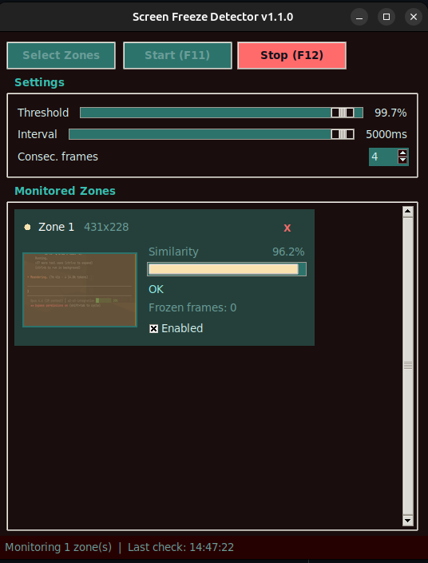

# Screen Freeze Detector

Monitors specific screen zones and plays an alert sound when any zone freezes (consecutive frames are nearly identical). Designed for detecting not moving screen areas.



## Features

- Draw N rectangular zones on a screenshot overlay
- Real-time similarity comparison using RMS pixel difference
- Configurable threshold, check interval, and consecutive frame count
- Visual progress bars per zone with color-coded status (green/yellow/red)
- Alert sound generated at runtime (no external audio files needed)
- Global hotkeys: **F11** start, **F12** stop (work even when app is not focused)
- Dark theme UI

## Requirements

- Linux (X11)
- Python >= 3.12
- `scrot` (screen capture)
- `aplay` (sound playback, from `alsa-utils`)
- `python3-tk` (tkinter)

## Quick start

```bash
uv sync
uv run python freeze_detector.py
```

## Usage

1. Click **Select Zones** -- a fullscreen screenshot appears
2. Drag rectangles over the areas you want to monitor
3. Press **Enter** to confirm (Escape to cancel, right-click to undo)
4. Adjust **Threshold**, **Interval**, and **Consec. frames** as needed
5. Click **Start (F11)** -- monitoring begins
6. When a zone is frozen for the required consecutive frames, an alert sounds
7. Click **Stop (F12)** to stop monitoring

## Install as .deb (Ubuntu/Debian)

```bash
bash build_deb.sh
sudo dpkg -i screensound_<version>_amd64.deb
sudo apt install -f  # if dependencies are missing
screensound
```

To uninstall:

```bash
sudo apt remove screensound
```

## Configuration

All defaults are constants at the top of `freeze_detector.py`:

| Constant                     | Default | Description                                    |
| ---------------------------- | ------- | ---------------------------------------------- |
| `DEFAULT_THRESHOLD`          | `0.995` | Similarity threshold to consider a zone frozen |
| `DEFAULT_INTERVAL_MS`        | `5000`  | Milliseconds between each check                |
| `DEFAULT_CONSECUTIVE_FRAMES` | `4`     | Consecutive frozen frames before alerting      |
| `ALERT_FREQUENCY`            | `880`   | Alert beep frequency in Hz                     |
| `ALERT_BEEPS`                | `2`     | Number of beeps per alert                      |
| `ALERT_COOLDOWN`             | `5.0`   | Seconds between repeated alerts                |

## Architecture

Single-file application (`freeze_detector.py`) following SOLID principles:

- **Protocols**: `ScreenCapturer`, `SoundPlayer`, `HotkeyListener`, `ImageComparator`
- **Implementations**: `ScrotCapturer`, `AplaySound`, `PynputHotkeys`, `RMSComparator`
- **Domain**: `ZoneConfig`, `ZoneState`, `FreezeMonitor`
- **UI**: `ZoneSelector`, `ZoneMonitorWidget`, `FreezeDetectorApp`
- **Composition root**: `main()` wires all dependencies

## License

MIT
