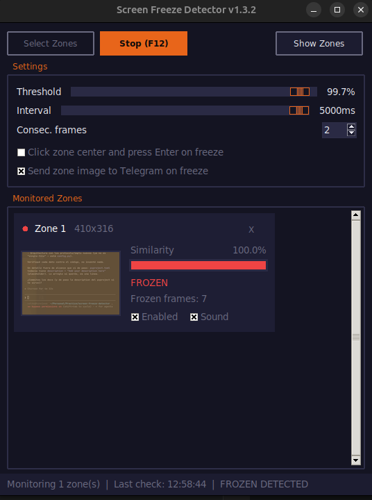

# Screen Freeze Detector

Monitors specific screen zones and reacts when any zone freezes (consecutive
captures are nearly identical). Designed for spotting non-moving areas — e.g. a
paused or buffering video. On freeze it can beep, auto-press Enter on the zone,
and act as a Telegram remote control: it sends the zone's image to your phone,
and your text reply gets typed back into the zone.

It is an **Electron desktop app** (macOS + Linux), living in [`electron/`](electron/).
An earlier Python/tkinter version was removed once the Electron port reached
parity (see git history).



> _The screenshot shows the earlier UI; the current app uses a light theme._

## Features

- Draw N rectangular, resizable zones on a fullscreen screenshot overlay
- Real-time similarity comparison (RMS pixel difference)
- Threshold / interval / consecutive-frames / volume controls — each a slider
  **and** a typeable numeric stepper (decimals supported)
- Per-zone traffic-light status: green below the threshold, yellow at/above it,
  red when frozen
- Per-zone toggles: Active, Sound, Press-Enter-on-freeze, Send-to-Telegram
- Independent Telegram **capture zone** per zone — photograph a different area
  than the one being watched for freezes
- Telegram remote control: zone image on freeze, tap-to-target buttons, typed
  replies, and `/status` · `/start` · `/stop` commands
- Preferences (zones, settings, defocus point) auto-save and restore on launch
- Global hotkeys: **F9** start · **F10** stop · **F8** select zones
- System tray, reset-to-defaults, global notification volume

## Run

The app lives in `electron/`:

```bash
cd electron
pnpm install
pnpm start
```

See **[`electron/README.md`](electron/README.md)** for setup details — native
module build, macOS Screen-Recording / Accessibility permissions, and packaging.

## Telegram remote control (optional)

On freeze, the frozen zone's image is sent to your chat; replying with text types
it into the target zone (+ Enter). Setup:

1. Create a bot: message **@BotFather** → `/newbot` → copy the **token**.
2. Get your **chat id**: send any message to the bot, open
   `https://api.telegram.org/bot<TOKEN>/getUpdates`, copy `chat.id`.
3. Enter the token and chat id in the app's **Settings** (auto-saved), or copy
   `.env.example` → `.env` and fill them in.

The poller only obeys messages from your configured `chat_id`; it uses
long-polling (no public URL) and skips old messages on start.

## Configuration

- Tunables live in [`electron/constants.js`](electron/constants.js): hotkeys,
  detection defaults, alarm cadence/gain, Telegram command words.
- Telegram credentials (`SCREENSOUND_TELEGRAM_TOKEN`,
  `SCREENSOUND_TELEGRAM_CHAT_ID`) auto-save to `~/.config/screensound/.env`
  (mode 0600).
- User preferences auto-save to `~/.config/screensound/settings.json`.
- The version comes from the `VERSION` file at the repo root (read by
  `electron/main.js`). Bump it by editing `VERSION`.

## Architecture

SOLID — a pure domain with injected adapters (see
[`electron/src/domain.ts`](electron/src/domain.ts)):

- **Domain** (`domain.ts`): `ZoneConfig`, `ZoneState`, `RMSComparator`,
  `FreezeMonitor`, `stateKind` — no OS, no Electron, no I/O.
- **Adapters**: `ScreenCapturer` (getDisplayMedia + canvas), `WebAudioSound`,
  nut.js input injection (in the main process), `TelegramNotifier` /
  `TelegramPoller` (fetch), `DiskPreferencesStore` (`prefs.ts`).
- **Composition root**: the renderer `src/capture-spike.ts` wires everything and
  drives the UI; `main.js` owns the window, tray, hotkeys, OS input, and the
  config/preferences files.

## License

MIT
